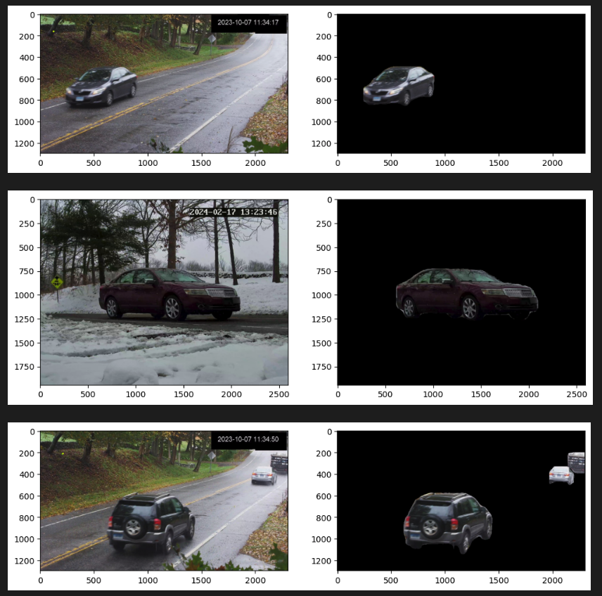
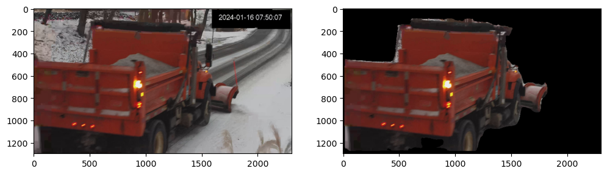
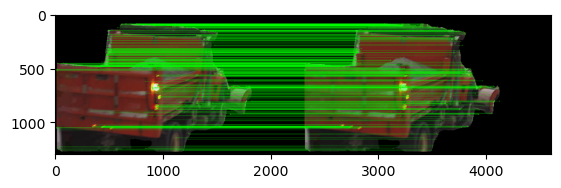

# yolo-traffice-data-image-processing

### Overview:


This project uses YOLOv8 to detect and mask vehicles in images and applies SIFT (Scale-Invariant Feature Transform) for extracting and matching keypoints across masked images. The following steps describe the key components of the code





Here I have used Yolo V8 model built by ultralytics to detect objects and extract required pixels.

Key Features
- Advanced Backbone and Neck Architectures: YOLOv8 employs state-of-the-art backbone and neck architectures, resulting in improved feature extraction and object detection performance.
- Anchor-free Split Ultralytics Head: YOLOv8 adopts an anchor-free split Ultralytics head, which contributes to better accuracy and a more efficient detection process compared to anchor-based approaches.
- Optimized Accuracy-Speed Tradeoff: With a focus on maintaining an optimal balance between accuracy and speed, YOLOv8 is suitable for real-time object detection tasks in diverse application areas.
- Variety of Pre-trained Models: YOLOv8 offers a range of pre-trained models to cater to various tasks and performance requirements, making it easier to find the right model for your specific use case.

## Code Explanation 

Import required packages

```python
from pathlib import Path
import os
import pprint as pp
import cv2 as cv
import numpy as np
from ultralytics import YOLO
import matplotlib.pyplot as plt
import matplotlib.patches as patches
from skimage.metrics import structural_similarity as ssim
%matplotlib inline
```

### Load the YOLOV8 model

```python
model = YOLO('yolov8n-seg.pt')
```

Loads a pre-trained YOLOv8 segmentation model (yolov8n-seg.pt).
This model is used for detecting objects in images and extracting segmentation masks for the detected objects.

### Vehicle Masking

The function vehicle_seg_2 detects vehicles in an input image and generates a binary mask to isolate them.

```python
def vehicle_seg_2(image_arr):
    target_classes = [2,3,4,5,6,7]
    result = model.predict(image_arr)
    cont=[]
    
    img = np.copy(result[0].orig_img)
    img_name = Path(result[0].path).stem # source image base-name
    b_mask = np.zeros(img.shape[:2], np.uint8)
    
    for r in result:
        for ci,c in enumerate(r):
            if c.boxes.cls in target_classes:
                

                #  Extract contour result
                contour = c.masks.xy.pop()
                #  Changing the type
                contour = contour.astype(np.int32)
                #  Reshaping
                contour = contour.reshape(-1, 1, 2)
                # print(contour.shape)

                cont.append(contour)

    for a in cont:
        _ = cv.drawContours(b_mask, [a], -1, (255, 255, 255), cv.FILLED)

    mask3ch = cv.cvtColor(b_mask, cv.COLOR_BGR2RGB)

    # Isolate object with binary mask
    isolated = cv.bitwise_and(mask3ch, img)

    return image_arr,isolated
```


- Input: An image array.
- Target Classes: Defines the vehicle classes to mask, such as cars, buses, or trucks.
- Output: The original image and the segmented image with masked vehicles.

### Processing and Masking Images

```python
random_images_path='random_images'
images_list=os.listdir(random_images_path)

output_folder='random_images/masked_images'
os.makedirs(output_folder, exist_ok=True)

n=0
for img in images_list:
    img_path=os.path.join(random_images_path,img)
    image_arr=cv.cvtColor(cv.imread(img_path), cv.COLOR_BGR2RGB)
    orig_image,segmented_image=vehicle_seg_2(image_arr)
    
    segmented_image_path = os.path.join(output_folder, f'segmented_{img}')
    cv.imwrite(segmented_image_path, cv.cvtColor(segmented_image, cv.COLOR_RGB2BGR))
    
    fig, ax = plt.subplots(1,2,figsize=(12,8))    
    ax[0].imshow(orig_image)
    ax[1].imshow(segmented_image)
    n+=1
    if n>5:
        break
```

- Input Folder: Contains raw images for processing.
- Output Folder: Stores the segmented images after masking vehicles.
- For each image:
    - It applies vehicle_seg_2 to detect and isolate vehicles.
    - Saves the masked image with a new name in the output folder.




### Keypoint Detection Matching - SIFT Algorithm

```python
masked_images_path='random_images/masked_images'
masked_images_list=os.listdir(masked_images_path)
txt='.jpg'

keypoints=[]

sift = cv.SIFT_create()

for img in masked_images_list:
    img_keypoints={}
    if txt in img:
        img1_path=os.path.join(masked_images_path,img)
        img1=cv.cvtColor(cv.imread(img1_path), cv.COLOR_BGR2RGB)
        kp1, des1 = sift.detectAndCompute(img1,None)
        for kp,des in zip(kp1,des1):
            img_keypoints[img]={}
            img_keypoints[img]['Descriptor']=des
            img_keypoints[img]['Keypoint']=kp.pt
            img_keypoints[img]['Size']=kp.size
            img_keypoints[img]['Angle']=kp.angle
            img_keypoints[img]['Response']=kp.response
            img_keypoints[img]['Octave']=kp.octave
            img_keypoints[img]['ClassID']=kp.class_id
            keypoints.append(img_keypoints)
            
        for img_to_match in masked_images_list:
            
            if (txt in img_to_match) and (img != img_to_match):
                
                img2_path=os.path.join(masked_images_path,img_to_match)
                img2=cv.cvtColor(cv.imread(img2_path), cv.COLOR_BGR2RGB)
                
                
                kp2, des2 = sift.detectAndCompute(img2,None)
                
                FLANN_INDEX_KDTREE = 1
                index_params = dict(algorithm = FLANN_INDEX_KDTREE, trees = 5)
                search_params = dict(checks=50)   # or pass empty dictionary
                flann = cv.FlannBasedMatcher(index_params,search_params)
                matches = flann.knnMatch(des1,des2,k=2)
                
                matchesMask = [[0,0] for i in range(len(matches))]
                
                for i,(m,n) in enumerate(matches):
                    if m.distance < 0.7*n.distance:
                        matchesMask[i]=[1,0]
                
                # print(matchesMask)
                # Count occurrences of [1, 0]
                count_of_matchedmasks = sum(1 for sublist in matchesMask if sublist == [1, 0])
                percentage_mask= round((count_of_matchedmasks/(len(matchesMask)))*100,0)
                print(count_of_matchedmasks,len(matchesMask),percentage_mask)
                if percentage_mask>50:
                    draw_params = dict(matchColor = (0,255,0),
                    singlePointColor = (255,0,0),
                    matchesMask = matchesMask,
                    flags = cv.DrawMatchesFlags_DEFAULT)
                    img3 = cv.drawMatchesKnn(img1,kp1,img2,kp2,matches,None,**draw_params)
                    plt.imshow(img3,),plt.show()
```

- This section uses SIFT to detect keypoints and descriptors in the masked images and compares them across pairs of images.
- Uses FLANN-based matching to find the closest matches between the descriptors of two images.
Filters matches using a distance ratio test to ensure accuracy.




